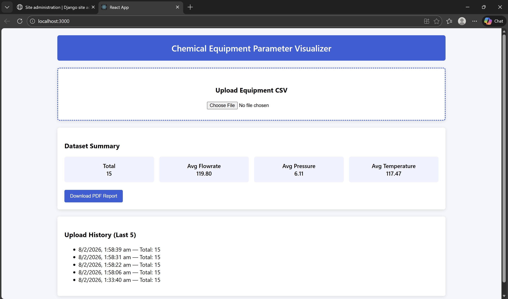
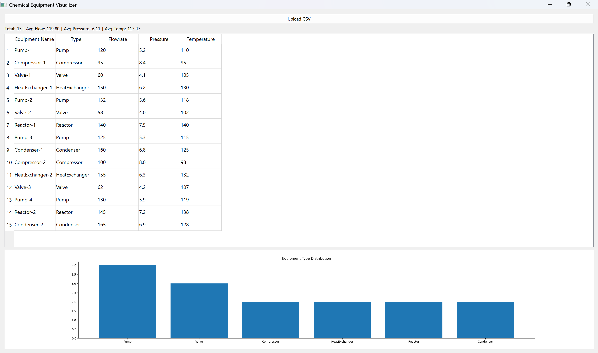

# Chemical Equipment Parameter Visualizer  
### Hybrid Web + Desktop Application

---

## 📌 Project Overview

The **Chemical Equipment Parameter Visualizer** is a hybrid software system designed to analyze, summarize, and visualize operational parameters of chemical equipment using a **single unified backend**.

The application supports both **Web** and **Desktop** clients, ensuring consistent analytics, visualization, and data processing across platforms.

Users upload CSV datasets containing equipment parameters such as **flowrate, pressure, and temperature**. The backend processes this data and exposes analytics through REST APIs consumed by both frontends.

---

## 🏗️ System Architecture

CSV Dataset
│
▼
Django REST API (Backend)
│
├── React Web Application (Charts + Tables)
│
└── PyQt5 Desktop Application (Charts + Tables)

markdown
Copy code

### Architecture Highlights
- Single backend system
- Multiple frontends (Web + Desktop)
- Centralized analytics logic
- Consistent visualization across platforms

---

## ✨ Key Features

- CSV file upload via **Web** and **Desktop** applications
- Automated data analysis using **Pandas**
- Summary statistics generation:
  - Total equipment count
  - Average flowrate, pressure, and temperature
  - Equipment type distribution
- Interactive data visualization:
  - **Web**: Chart.js
  - **Desktop**: Matplotlib
- Dataset history management (last 5 uploads)
- Secure REST APIs using **Basic Authentication**

---

## 🛠️ Tech Stack

### Backend
- Python  
- Django  
- Django REST Framework  
- Pandas  
- SQLite  

### Web Frontend
- React.js  
- Axios  
- Chart.js  

### Desktop Frontend
- PyQt5  
- Matplotlib  
- Requests  

### Other Tools
- Git & GitHub  

---

## 📁 Project Structure

chemical-equipment-visualizer/
│
├── backend/
│ └── server/
│ ├── equipment/
│ ├── server/
│ └── manage.py
│
├── web-frontend/
│ └── equipment-web/
│
├── desktop-frontend/
│ └── app.py
│
├── sample_equipment_data.csv
├── screenshots/
├── README.md
└── .gitignore

yaml
Copy code

---

## ⚙️ Setup Instructions

### 1️⃣ Backend Setup

```bash
cd backend
python -m venv venv
venv\Scripts\activate
pip install django djangorestframework pandas django-cors-headers
cd server
python manage.py migrate
python manage.py createsuperuser
python manage.py runserver
Backend URL:

cpp
Copy code
http://127.0.0.1:8000
2️⃣ Web Frontend Setup
bash
Copy code
cd web-frontend/equipment-web
npm install
npm start
Web Application URL:

arduino
Copy code
http://localhost:3000
3️⃣ Desktop Application Setup
bash
Copy code
cd desktop-frontend
python -m venv venv
venv\Scripts\activate
pip install pyqt5 matplotlib pandas requests
python app.py
🔌 API Endpoints
Method	Endpoint	Description
POST	/api/upload/	Upload CSV and generate analytics
GET	/api/history/	Retrieve last 5 dataset summaries

All endpoints are protected using Basic Authentication.

📄 Sample Dataset
A sample CSV file sample_equipment_data.csv is included for testing.

Expected Columns
Equipment Name

Type

Flowrate

Pressure

Temperature

🎯 Learning Outcomes
Hybrid application architecture design

REST API development using Django

Frontend–backend integration

Data analytics with Pandas

Cross-platform data visualization

Secure API authentication

🖼️ Screenshots
Web Application – Dashboard

CSV upload interface

Summary statistics displayed using cards

Interactive charts for equipment parameters



Desktop Application – PyQt5 Interface

CSV upload through desktop client

Tabular equipment data view

Equipment type distribution visualization



📌 Notes

This project uses a single backend serving both Web and Desktop clients

Analytics logic is centralized to ensure consistency

Designed for academic evaluation and system design demonstration